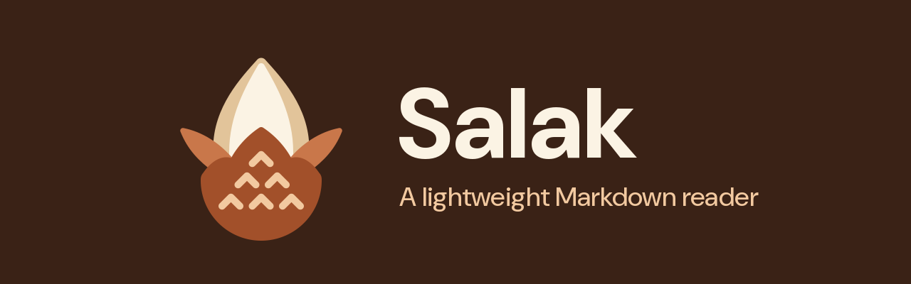

# Salak

A lightweight, read-only Markdown reader for the desktop.

- File tree of a folder, IDE style, loaded lazily.
- Tabs, one per opened document.
- GitHub-like rendering: tables, footnotes, task lists, strikethrough.
- Light and dark themes, following the system preference.
- Custom theme, applied live while you edit it.
- Watches the opened file and offers to reload it when it changes.
- Keyboard driven, designed to fit tiling window managers such as sway.

Salak is written in Rust, in three crates:

- `salak-core`: the logic shared by both applications (command line, files,
  Markdown parsing, links, themes, help pages);
- `salak-gtk`: the Linux application, native GTK 4 and libadwaita, with no web
  engine;
- `salak-tauri`: the Windows application, built with [Tauri 2](https://tauri.app)
  and WebView2, with a plain HTML, CSS and JavaScript frontend.

## Download

The Debian package, the Windows installer and a portable Windows build are
published on the [releases page](https://github.com/tiziolabs/salak/releases).
Salak can also be built from source, see [Building](#building).

## Usage

```sh
salak                 # welcome page, to open a file or a folder
salak .               # browse the current directory
salak ~/notes         # browse a folder
salak README.md       # open a file, browsing its folder
salak --theme dark.ini  # use another theme
```

### Keys

| Key | Action |
| --- | --- |
| `Ctrl+O` | Open a file |
| `Ctrl+Shift+O` | Open a folder |
| `Ctrl+W` | Close the tab |
| `Ctrl+PageDown` / `Ctrl+PageUp` | Next / previous tab |
| `Ctrl+Q` | Quit |
| `F1` | Show the user guide |
| `Tab` | Switch focus between the tree and the document |
| `↑` `↓` / `j` `k` | Move in the tree, scroll the document |
| `←` `→` / `h` `l` | Collapse / expand a folder |
| `Enter` / `o` | Open the selected file or toggle the folder |
| `g` / `G` | Go to top / bottom |
| `d` / `u` | Scroll half a page down / up |
| `r`, `F5`, `Ctrl+R` | Reload the document |
| `Esc` | Dismiss the "file changed" banner |
| `b`, `Ctrl+B` | Toggle the sidebar |

## Custom theme

Salak applies a user theme on top of its default look, and reloads it live at
every save: `~/.config/salak/theme.ini` on Linux (honoring `$XDG_CONFIG_HOME`),
`%APPDATA%\salak\theme.ini` on Windows, or the file given with
`--theme FILE`. It is a small INI file, not CSS.

The [theming guide](crates/salak-core/help/theming.md), also in the **Help** menu, explains
how to make a theme: colors, light and dark modes, code highlighting, fonts.
It also tells how to migrate a `style.css` from version 0.1.0.

## Building

Salak needs GTK 4.16 and libadwaita 1.6 or later: Debian 13 (trixie),
Ubuntu 25.04 or any later release, or another distribution as recent.
Ubuntu 24.04 is too old. Requirements on Linux: a Rust toolchain
(1.92 or later, see `rust-version` of `salak-gtk`) and the development files of
GTK 4, libadwaita and GtkSourceView. On Debian / Ubuntu:

```sh
sudo apt install build-essential pkg-config libgtk-4-dev libadwaita-1-dev libgtksourceview-5-dev
```

On Debian 13, whose rustc is 1.85, take Rust from the backports
(`sudo apt install -t trixie-backports rustc cargo`) or from
[rustup](https://rustup.rs).

On Arch: `sudo pacman -S --needed base-devel gtk4 libadwaita gtksourceview5`.

Then a plain Cargo build is enough:

```sh
cargo build --release -p salak-gtk
./target/release/salak
```

The root workspace only holds the Linux crates; `salak-tauri` is a workspace
of its own, in `crates/salak-tauri`. Syntax highlighting of code blocks, done by GtkSourceView, is enabled by
default; to build without it:

```sh
cargo build --release -p salak-gtk --no-default-features
```

Run the tests with `cargo test -p salak-core -p salak-gtk`. They need no
display.

The release procedure is described in [RELEASING.md](RELEASING.md).

### Debian package

With [cargo-deb](https://crates.io/crates/cargo-deb):

```sh
cargo install cargo-deb
cargo deb -p salak-gtk --profile dist
sudo apt install ./target/debian/salak_*.deb
```

The `dist` profile, defined in the root `Cargo.toml`, makes a smaller binary
than `release`: stripped, optimized for size, with link-time optimization.

The package installs the binary, a desktop entry that opens Markdown files,
the AppStream metadata, a man page and the icons. Its dependencies are taken
from the libraries the binary links to, so it only installs on systems at
least as recent as the build system: build it on the oldest release to
support.

### Windows

The Windows application is the Tauri one. `cargo build --release` in
`crates/salak-tauri`, which is a workspace of its own, builds it on any system with the Tauri requirements (on Linux, WebKitGTK), but
it is only packaged for Windows.

### Windows installer

The installer is built on Windows, with the Tauri CLI. Requirements:

- [Microsoft C++ Build Tools](https://visualstudio.microsoft.com/visual-cpp-build-tools/),
  with the "Desktop development with C++" workload;
- Rust, installed with [rustup](https://rustup.rs) (MSVC toolchain, the
  default);
- WebView2, already present on Windows 10 and 11.

Then, in the repository:

```powershell
cargo install tauri-cli --version "^2" --locked
cd crates/salak-tauri
cargo tauri build
```

The installer is written to `crates\salak-tauri\target\release\bundle\nsis\`, as
`Salak_<version>_x64-setup.exe`. It installs Salak for the current user
without administrator rights, adds it to the Start menu, offers it to open
Markdown files, and downloads WebView2 if it is missing. The settings
specific to Windows are in `tauri.windows.conf.json`.

`crates\salak-tauri\target\release\salak.exe` also works on its own, without installing.

The installer is not signed: Windows SmartScreen warns about it on first
launch ("More info", then "Run anyway").

## sway

Salak runs natively on Wayland. When it detects sway, i3 or Hyprland, it
disables its own window decorations and lets the compositor draw them.
The window title is the name of the opened file.

Example rules in `~/.config/sway/config` (check the `app_id` with
`swaymsg -t get_tree` if needed):

```
bindsym $mod+m exec salak ~/notes
for_window [app_id="com.tiziolabs.salak"] floating enable, resize set 1100 800
```


## Security

Salak only gives access to files inside the opened folder. On Linux it does
not render HTML at all: only `<br>`, `<kbd>`, `<sup>` and `<sub>` are
interpreted, other tags are dropped. On Windows, raw HTML is sanitized with
[ammonia](https://crates.io/crates/ammonia) and scripts are forbidden by a
Content Security Policy.

## License

Licensed under either of

- Apache License, Version 2.0 ([LICENSE-APACHE](LICENSE-APACHE) or
  <https://www.apache.org/licenses/LICENSE-2.0>)
- MIT license ([LICENSE-MIT](LICENSE-MIT) or <https://opensource.org/licenses/MIT>)

at your option.

Unless you explicitly state otherwise, any contribution intentionally submitted
for inclusion in the work by you, as defined in the Apache-2.0 license, shall be
dual licensed as above, without any additional terms or conditions.
